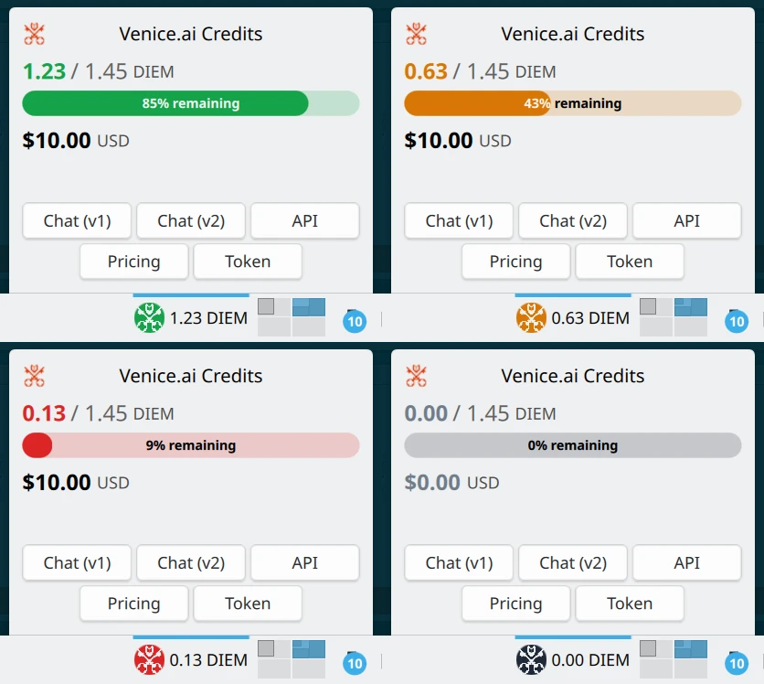

# Venice.ai Credits Widget for KDE Plasma 6

A KDE Plasma 6 widget (plasmoid) that displays your [Venice.ai](https://venice.ai/) API credits and usage information on the desktop or panel.

It stores the API token securely in KWallet via `libsecret`.

## Screenshots

Compact display in panel, color coded, configurable text options:


Show full widget on click, with configurable quick link buttons:



Transparent background support for use as desktop widget over a wallpaper:


## Install

Requirements:

- KDE Plasma 6.
- `secret-tool` (provided by `libsecret-tools` or `libsecret` packages in most distributions).

Installing the widget:

```bash
make install
```

After installing, right-click your desktop or panel, choose **Add Widgets**, and search for "Venice.ai Credits". Open the widget's settings to enter your Venice.ai API token.

Uninstalling the widget:

```bash
make uninstall
```

## Develop

**Preview the widget without installing**

```bash
make dev
```

This launches `plasmoidviewer` pointed at the local `package/` directory.

**View live logs**

```bash
make logs
```

Streams `plasmashell` journal output via `journalctl`.

**Restart the Plasma shell** (picks up changes to an installed widget)

```bash
make restart
```

**Project structure**

```
package/
  metadata.json                # Widget metadata (Plasma 6 format)
  contents/
    ui/
      main.qml                # Main widget UI
      config/
        ConfigGeneral.qml     # General settings (token management)
        ConfigAppearance.qml  # Appearance settings (background, colors)
        ConfigLinks.qml       # Links settings (quick link buttons)
    config/
      config.qml              # ConfigModel (declares config categories)
      main.xml                # KConfig schema (appearance prefs)
    code/
      api.js                  # Venice.ai API client
      secret.js               # KWallet helper wrapper
      kwallet.sh              # secret-tool CLI helper for load/store/clear
```
