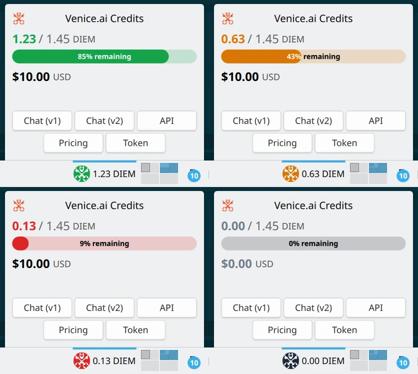

# Venice.ai Balance Widget for KDE Plasma 6

A KDE Plasma 6 widget (plasmoid) that displays your [Venice.ai](https://venice.ai/) API balance information on the desktop or panel.

It stores the API token securely in KWallet via `libsecret`.

## Disclaimer

This package is not related to or developed by Venice. No relationship between the developer of this package and Venice exists.

All trademarks, logos and brand names are the property of their respective owners. All company, product and service names used in this package are for identification purposes only. Use of these names, trademarks and brands does not imply endorsement.

## AI disclaimer

This project was AI-generated. The author uses it daily, but **use at your own risk**.

## Screenshots

Compact display in panel, color coded, configurable text options:


Show full widget on click, with configurable quick link buttons:



Transparent background support for use as desktop widget over a wallpaper:


## Install

Requirements:

- KDE Plasma 6.
- `secret-tool` (provided by `libsecret-tools` or `libsecret` packages in most distributions).

**From the KDE Store:** right-click your desktop or panel, choose **Add Widgets**, click **Get New Widgets**, search for "Venice.ai Balance" and click **Install**. Store page: <https://www.opendesktop.org/p/2368690/>

**From source:**

```bash
make install
```

After installing, right-click your desktop or panel, choose **Add Widgets**, and search for "Venice.ai Balance". Open the widget's settings to enter your Venice.ai API token.

Uninstalling a source install:

```bash
make uninstall
```

(Store installs are removed from the widget explorer's **Uninstall** button.)

## Develop

**Preview the widget without installing**

```bash
make dev
```

This launches `plasmoidviewer` pointed at the local `package/` directory.

**View live logs**

```bash
make logs
```

Streams `plasmashell` journal output via `journalctl`.

**Restart the Plasma shell** (picks up changes to an installed widget)

```bash
make restart
```

**Build the store package**

```bash
make package
```

Creates `net.fidelramos.kde.veniceai-<version>.plasmoid` (version read from `package/metadata.json`) for KDE Store submission.

**Project structure**

```
package/
  metadata.json                # Widget metadata (Plasma 6 format)
  contents/
    ui/
      main.qml                # Main widget UI
      config/
        ConfigGeneral.qml     # General settings (token management)
        ConfigAppearance.qml  # Appearance settings (background, colors)
        ConfigLinks.qml       # Links settings (quick link buttons)
    config/
      config.qml              # ConfigModel (declares config categories)
      main.xml                # KConfig schema (appearance prefs)
    code/
      api.js                  # Venice.ai API client
      secret.js               # KWallet helper wrapper
      kwallet.sh              # secret-tool CLI helper for load/store/clear
```
